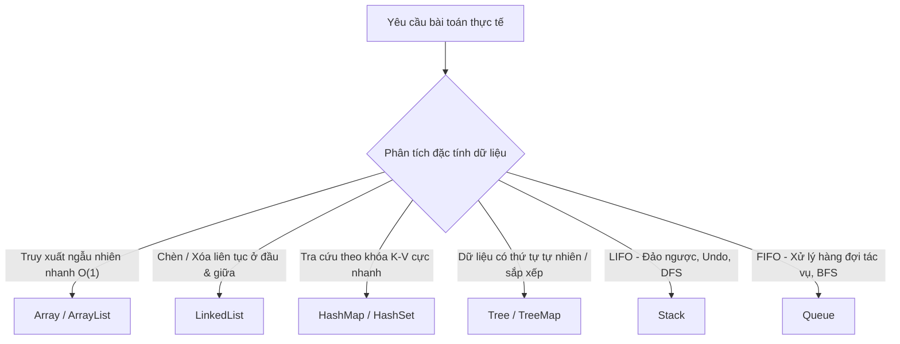

Trong hành trình phát triển phần mềm, đặc biệt là với hệ sinh thái Java doanh nghiệp, **Cấu trúc dữ liệu & Giải thuật (Data Structures & Algorithms - DSA)** đóng vai trò là xương sống quyết định hiệu năng, khả năng mở rộng (scalability) và sự ổn định của hệ thống.

Bài viết này tổng hợp toàn bộ lộ trình ôn tập và rèn luyện DSA từ chương trình **Java Fresher**, kết hợp tư duy giải quyết vấn đề qua bài toán thiết kế thực tế hệ thống **Quản lý học tập (LMS)**.

---

## 1. Mục Tiêu Học Tập & Tư Duy Lập Trình

Khi học và áp dụng DSA vào các dự án Java, mục tiêu cốt lõi không chỉ là giải quyết các câu đố thuật toán thuần túy, mà tập trung vào:

1. **Hiểu cách thiết kế hệ thống bằng Java:** Áp dụng mô hình OOP kết hợp cấu trúc dữ liệu thích hợp để mô hình hóa thực thể.
2. **Chọn lựa cấu trúc dữ liệu phù hợp:** Phân biệt khi nào dùng `ArrayList`, `LinkedList`, `HashMap`, `TreeMap`, hay `PriorityQueue`.
3. **Áp dụng thuật toán đúng tình huống:** Tối ưu hóa các thao tác tìm kiếm, sắp xếp và duyệt dữ liệu.
4. **Rèn luyện tư duy phân tích độ phức tạp:** Đánh giá Big-O thời gian ($O(1)$, $O(\log n)$, $O(n)$, $O(n \log n)$, $O(n^2)$) và không gian bộ nhớ.



---

## 2. Các Cấu Trúc Dữ Liệu Nòng Cốt

### 2.1 Bảng So Sánh Độ Phức Tạp (Big-O Complexity)

| Cấu trúc dữ liệu | Truy cập ngẫu nhiên | Tìm kiếm | Chèn (Insertion) | Xóa (Deletion) | Tình huống sử dụng phổ biến |
| :--- | :---: | :---: | :---: | :---: | :--- |
| **Array / ArrayList** | $\mathcal{O}(1)$ | $\mathcal{O}(n)$ | $\mathcal{O}(n)$ | $\mathcal{O}(n)$ | Đọc nhiều, ít khi chèn giữa |
| **LinkedList** | $\mathcal{O}(n)$ | $\mathcal{O}(n)$ | $\mathcal{O}(1)$ | $\mathcal{O}(1)$ | Thường xuyên thêm/xóa đầu-đuôi |
| **Stack (LIFO)** | $\mathcal{O}(n)$ | $\mathcal{O}(n)$ | $\mathcal{O}(1)$ | $\mathcal{O}(1)$ | Ngăn xếp gọi hàm, undo/redo, duyệt DFS |
| **Queue (FIFO)** | $\mathcal{O}(n)$ | $\mathcal{O}(n)$ | $\mathcal{O}(1)$ | $\mathcal{O}(1)$ | Hàng đợi tin nhắn, xử lý job bất đồng bộ, BFS |
| **HashMap** | N/A | $\mathcal{O}(1)^*$ | $\mathcal{O}(1)^*$ | $\mathcal{O}(1)^*$ | Cache, index dữ liệu, tra cứu ID tức thời |
| **Binary Search Tree** | $\mathcal{O}(\log n)$ | $\mathcal{O}(\log n)$ | $\mathcal{O}(\log n)$ | $\mathcal{O}(\log n)$ | Dữ liệu phân cấp, tìm kiếm có thứ tự |

> [!NOTE]
> `*` Đối với `HashMap`, độ phức tạp trung bình là $\mathcal{O}(1)$. Trong trường hợp xấu nhất khi xảy ra xung đột băm (hash collision) liên tục, Java 8+ tự động chuyển bucket từ LinkedList sang Red-Black Tree để duy trì độ phức tạp $\mathcal{O}(\log n)$.

---

## 3. Ứng Dụng Thực Tế: Dự Án Quản Lý Học Tập (LMS)

Để nắm vững cấu trúc dữ liệu, bài toán thực tế được triển khai là module quản lý thông tin sinh viên và khóa học trong **Learning Management System (LMS)**.

### 3.1 Thiết kế Mô hình Thực thể Sinh viên

```java
import java.util.Objects;

public class Student implements Comparable<Student> {
    private String id;
    private String name;
    private double gpa;

    public Student(String id, String name, double gpa) {
        this.id = id;
        this.name = name;
        this.gpa = gpa;
    }

    public String getId() { return id; }
    public String getName() { return name; }
    public double getGpa() { return gpa; }

    @Override
    public int compareTo(Student o) {
        // Sắp xếp mặc định theo GPA giảm dần
        return Double.compare(o.gpa, this.gpa);
    }

    @Override
    public boolean equals(Object o) {
        if (this == o) return true;
        if (!(o instanceof Student)) return false;
        Student student = (Student) o;
        return Objects.equals(id, student.id);
    }

    @Override
    public int hashCode() {
        return Objects.hash(id);
    }

    @Override
    public String toString() {
        return String.format("Student[ID=%s, Name=%s, GPA=%.2f]", id, name, gpa);
    }
}
```

### 3.2 Tối Ưu Tra Cứu và Lọc Danh Sách Sinh Viên

Kết hợp giữa `HashMap` (cho tốc độ tra cứu ID $O(1)$) và `PriorityQueue` (cho việc lấy Top $K$ sinh viên có điểm cao nhất mà không cần sort toàn bộ mảng):

```java
import java.util.*;

public class StudentLmsService {
    // Tra cứu sinh viên theo mã số sinh viên O(1)
    private final Map<String, Student> studentIndex = new HashMap<>();

    public void addStudent(Student student) {
        if (studentIndex.containsKey(student.getId())) {
            throw new IllegalArgumentException("Mã sinh viên đã tồn tại: " + student.getId());
        }
        studentIndex.put(student.getId(), student);
    }

    public Student findById(String id) {
        return studentIndex.get(id);
    }

    /**
     * Lấy Top K sinh viên GPA cao nhất dùng Min-Heap:
     * Độ phức tạp: O(N log K) thay vì O(N log N) khi sắp xếp toàn bộ.
     */
    public List<Student> getTopKStudents(int k) {
        if (k <= 0) return Collections.emptyList();

        // Min-Heap theo GPA
        PriorityQueue<Student> minHeap = new PriorityQueue<>(Comparator.comparingDouble(Student::getGpa));

        for (Student student : studentIndex.values()) {
            minHeap.offer(student);
            if (minHeap.size() > k) {
                minHeap.poll(); // Loại bỏ sinh viên có điểm thấp nhất trong top
            }
        }

        List<Student> result = new ArrayList<>(minHeap);
        result.sort(Comparator.comparingDouble(Student::getGpa).reversed());
        return result;
    }
}
```

---

## 4. Các Thuật Toán Trọng Tâm Cần Luyện Tập

### 4.1 Tìm Kiếm Nhị Phân (Binary Search)
Áp dụng trên mảng đã sắp xếp với độ phức tạp $\mathcal{O}(\log n)$:

```java
public static int binarySearch(int[] arr, int target) {
    int left = 0;
    int right = arr.length - 1;

    while (left <= right) {
        int mid = left + (right - left) / 2; // Tránh tràn số nguyên
        if (arr[mid] == target) {
            return mid;
        } else if (arr[mid] < target) {
            left = mid + 1;
        } else {
            right = mid - 1;
        }
    }
    return -1;
}
```

### 4.2 Thuật Toán Sắp Xếp Nhanh (QuickSort)
Thuật toán phân chia và trị kinh điển, thời gian trung bình $\mathcal{O}(n \log n)$:

```java
public static void quickSort(int[] arr, int low, int high) {
    if (low < high) {
        int pivotIndex = partition(arr, low, high);
        quickSort(arr, low, pivotIndex - 1);
        quickSort(arr, pivotIndex + 1, high);
    }
}

private static int partition(int[] arr, int low, int high) {
    int pivot = arr[high];
    int i = low - 1;
    for (int j = low; j < high; j++) {
        if (arr[j] <= pivot) {
            i++;
            int temp = arr[i];
            arr[i] = arr[j];
            arr[j] = temp;
        }
    }
    int temp = arr[i + 1];
    arr[i + 1] = arr[high];
    arr[high] = temp;
    return i + 1;
}
```

---

## 5. Tài Liệu Học Tập & Link Ôn Tập Trực Tuyến

> [!TIP]
> Sử dụng trợ lý ôn tập tương tác dựa trên AI NotebookLM để giải đáp thắc mắc và luyện đề:
> - 🧠 **NotebookLM Ôn tập DSA:** [Mở NotebookLM DSA](https://notebooklm.google.com/notebook/7a16d3b5-e149-422d-9813-1c05ee609dd9)
---

## 6. Tổng Kết

Nắm vững cấu trúc dữ liệu và giải thuật giúp bạn:
- Tự tin vượt qua các vòng phỏng vấn kỹ thuật (Coding Assessment, Technical Interview).
- Viết mã nguồn Java ngắn gọn, sạch sẽ, tối ưu hiệu năng và bộ nhớ.
- Tạo nền móng vững chắc cho các môn học nâng cao tiếp theo như **Cơ sở dữ liệu (SQL)** và **Java Core OOP**.
