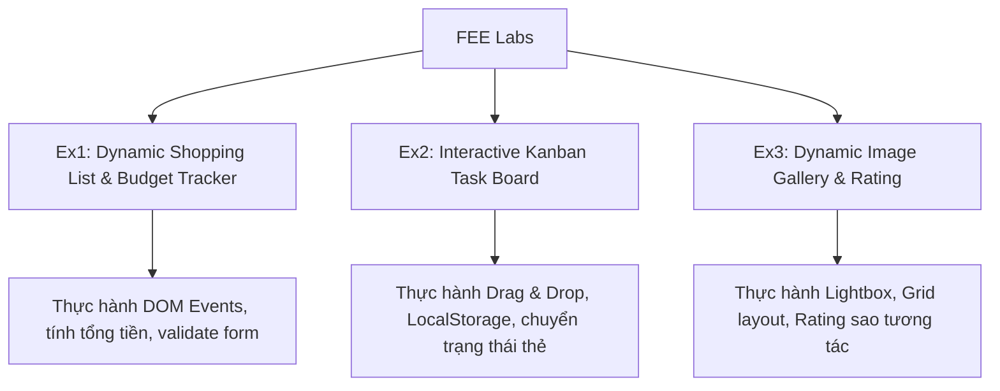

Đối với một kỹ sư phần mềm định hướng **Java Fullstack Developer**, việc hiểu sâu về tầng giao diện người dùng (**Front-End Engineering - FEE**) là bắt buộc để có thể kết nối mượt mà giữa API phía Backend và trải nghiệm người dùng (UX) phía Client.

Môn học FEE trang bị bộ ba trụ cột vững chắc: **HTML5** (cấu trúc ngữ nghĩa), **CSS3** (giao diện, bố cục đáp ứng responsive), và **JavaScript ES6+** (logic tương tác động phía trình duyệt).

---

## 1. Trụ Cột 1: Cấu Trúc Ngữ Nghĩa HTML5

HTML hiện đại không đơn thuần là các thẻ `<div>` và `<span>`. Việc sử dụng các thẻ ngữ nghĩa (**Semantic HTML**) giúp tối ưu khả năng đọc màn hình (Accessibility - a11y) và chuẩn hóa SEO:

```html
<!DOCTYPE html>
<html lang="vi">
<head>
    <meta charset="UTF-8">
    <meta name="viewport" content="width=device-width, initial-scale=1.0">
    <title>Học Quản Lý Tác Vụ - FEE</title>
    <link rel="stylesheet" href="style.css">
</head>
<body>
    <header class="app-header">
        <h1>Bảng Điều Khiển Tác Vụ (Kanban Lite)</h1>
        <nav class="main-nav">
            <ul>
                <li><a href="#todo">Cần Làm</a></li>
                <li><a href="#in-progress">Đang Thực Hiện</a></li>
                <li><a href="#done">Đã Xong</a></li>
            </ul>
        </nav>
    </header>

    <main class="kanban-board">
        <section id="todo" class="kanban-column">
            <h2>To-Do</h2>
            <article class="task-card">
                <h3>Thiết kế ERD Database</h3>
                <p>Hoàn thành mô hình quan hệ cho hệ thống LMS.</p>
                <time datetime="2026-10-10">Hạn: 10/10/2026</time>
            </article>
        </section>
    </main>

    <footer class="app-footer">
        <p>&copy; 2026 Java Fresher Program. All rights reserved.</p>
    </footer>
</body>
</html>
```

---

## 2. Trụ Cột 2: Bố Cục Hiện Đại Với CSS3 (Flexbox & Grid)

### 2.1 CSS Flexbox (Bố Cục Một Chiều)
Rất lý tưởng cho thanh điều hướng, căn giữa phần tử hoặc xếp hàng thẻ:

```css
.navbar {
    display: flex;
    justify-content: space-between; /* Đẩy logo sang trái, menu sang phải */
    align-items: center;            /* Căn giữa theo trục dọc */
    padding: 1rem 2rem;
    background-color: #1e293b;
    color: #ffffff;
}
```

### 2.2 CSS Grid (Bố Cục Hai Chiều)
Giải pháp hoàn hảo để chia lưới responsive mà không cần quá nhiều media query:

```css
.kanban-board {
    display: grid;
    /* Tự động chia số cột theo độ rộng màn hình (tối thiểu 300px mỗi cột) */
    grid-template-columns: repeat(auto-fit, minmax(300px, 1fr));
    gap: 1.5rem;
    padding: 2rem;
}

.kanban-column {
    background-color: #f8fafc;
    border-radius: 8px;
    padding: 1rem;
    border: 1px solid #e2e8f0;
}
```

---

## 3. Trụ Cột 3: JavaScript ES6+ & Thao Tác DOM

JavaScript hiện đại mang lại cú pháp ngắn gọn, trực quan thông qua Destructuring, Arrow Functions, Template Literals và API `fetch`:

```javascript
// Quản lý danh sách tác vụ động
class KanbanManager {
    constructor() {
        this.tasks = [];
        this.taskContainer = document.querySelector("#todo");
    }

    // Thêm tác vụ mới và render lại DOM
    addTask({ title, description, deadline }) {
        const newTask = {
            id: Date.now(),
            title,
            description,
            deadline: deadline || "Chưa đặt",
            completed: false
        };

        this.tasks.push(newTask);
        this.renderTask(newTask);
    }

    renderTask(task) {
        const card = document.createElement("article");
        card.className = "task-card";
        card.setAttribute("data-id", task.id);
        card.innerHTML = `
            <h3>${task.title}</h3>
            <p>${task.description}</p>
            <time>Hạn: ${task.deadline}</time>
            <button class="btn-delete" onclick="kanban.deleteTask(${task.id})">Xóa</button>
        `;
        this.taskContainer.appendChild(card);
    }

    deleteTask(taskId) {
        this.tasks = this.tasks.filter(t => t.id !== taskId);
        const cardEl = document.querySelector(`[data-id='${taskId}']`);
        if (cardEl) cardEl.remove();
    }
}

const kanban = new KanbanManager();
```

---

## 4. Dự Án Thực Hành Trọng Tâm

Trong quá trình học FEE, sinh viên hoàn thành các bài thực hành mang tính ứng dụng thực tế cao:



---

## 5. Tiện Ích & Công Cụ Khuyên Dùng

Trong quá trình thiết kế và làm giao diện web, có thể tận dụng các công cụ đắc lực:
1. **Lấy mã màu hài hòa:** [Kigen Design Color](https://kigen.design/color)
2. **Soi nhanh CSS của website bất kỳ:** [Extension CSS Peeper](https://chromewebstore.google.com/detail/css-peeper/mbnbehikldjhnfehhnaidhjhoofhpehk)
3. **Tra cứu tài liệu chuẩn:** [W3Schools Web Tutorials](https://www.w3schools.com/)

---

## 6. Tài Nguyên & Link Ôn Tập

> [!TIP]
> - 🧠 **NotebookLM Ôn tập Front-End:** [Mở NotebookLM FEE](https://notebooklm.google.com/notebook/8e644120-4d82-4a2e-bf3d-b7c4844d0169)
> - 📂 **Quy tắc tổ chức bài tập Git:** Tạo thư mục `FEE/` và lưu các bài lab theo tên `Ex1, Ex2...` (Notion) hoặc `ASM1, ASM2...` (FSA).
