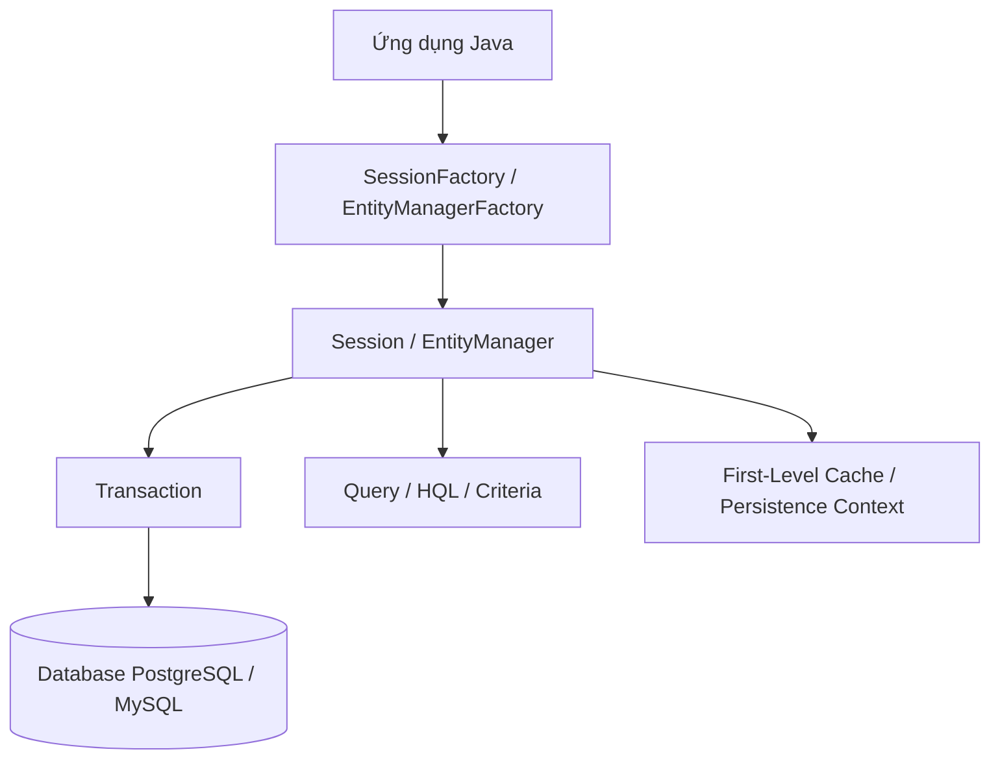
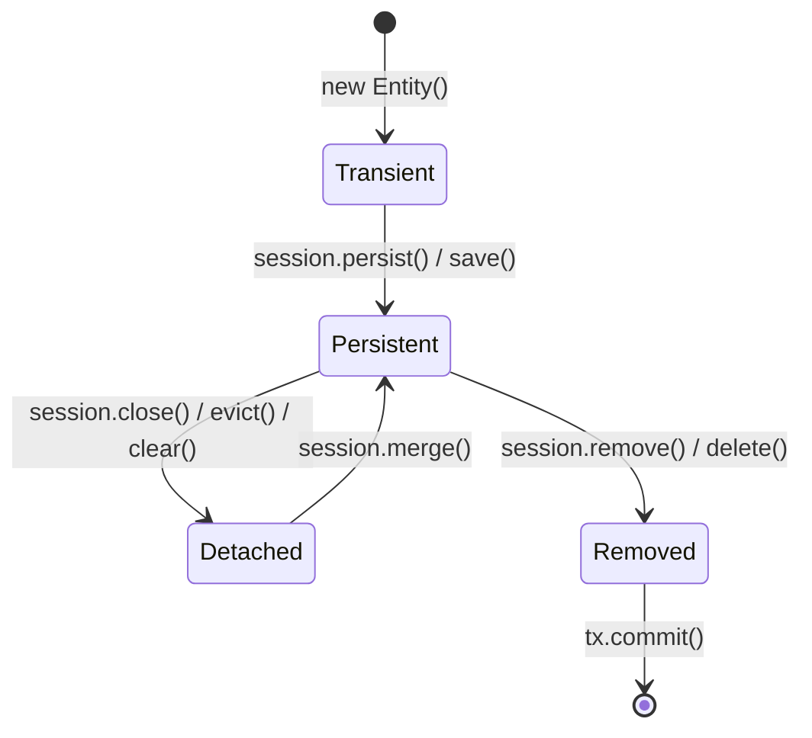
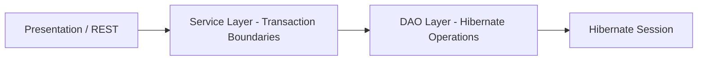

Trong các ứng dụng doanh nghiệp quy mô lớn, việc viết mã SQL thủ công bằng JDBC thường dẫn đến mã nguồn cồng kềnh, khó bảo trì và dễ mắc lỗi không tương thích giữa mô hình hướng đối tượng (OOP) và cơ sở dữ liệu quan hệ (RDBMS) &mdash; hiện tượng được gọi là **Object-Relational Impedance Mismatch**.

**Hibernate** là framework ORM (Object-Relational Mapping) mạnh mẽ nhất trong hệ sinh thái Java, đóng vai trò cài đặt tham chiếu cho chuẩn **Jakarta Persistence (JPA)**.

---

## 1. Kiến Trúc Cốt Lõi Của Hibernate



- **SessionFactory (hoặc EntityManagerFactory):** Đối tượng thread-safe, nặng, được khởi tạo một lần duy nhất khi ứng dụng khởi động để đọc cấu hình metadata.
- **Session (hoặc EntityManager):** Đối tượng nhẹ, đại diện cho một kết nối đơn lẻ giữa ứng dụng và cơ sở dữ liệu, không thread-safe.
- **Transaction:** Quản lý ranh giới giao dịch ACID để bảo đảm toàn vẹn dữ liệu.

---

## 2. Vòng Đời Của Đối Tượng (Entity Lifecycle)

Một thực thể trong Hibernate luôn nằm ở một trong 4 trạng thái sau:



| Trạng thái | Thuộc tính Khóa chính (ID)? | Được quản lý bởi Session? | Tương ứng trong DB? |
| :--- | :---: | :---: | :---: |
| **Transient (Tạm thời)** | Thường là `null` | Không | Chưa có dòng nào |
| **Persistent (Bền vững)** | Đã có ID | Có (trong First-Level Cache) | Đã có hoặc sắp được ghi vào DB |
| **Detached (Tách rời)** | Đã có ID | Không (Session đã đóng) | Có dòng trong DB |
| **Removed (Đã xóa)** | Đã có ID | Có (chuẩn bị xóa) | Dòng sẽ bị xóa khi commit |

---

## 3. Các JPA Annotations Ánh Xạ Quan Hệ Phổ Biến

### 3.1 Thực thể Khóa Ngoại Một - Nhiều (One-to-Many & Many-to-One)

```java
import jakarta.persistence.*;
import java.util.ArrayList;
import java.util.List;

@Entity
@Table(name = "departments")
public class Department {

    @Id
    @GeneratedValue(strategy = GenerationType.IDENTITY)
    private Long id;

    @Column(name = "name", nullable = false, length = 100)
    private String name;

    // Quan hệ 1 phòng ban có nhiều nhân viên
    @OneToMany(mappedBy = "department", cascade = CascadeType.ALL, orphanRemoval = true, fetch = FetchType.LAZY)
    private List<Employee> employees = new ArrayList<>();

    // Helper methods duy trì tính toàn vẹn 2 chiều
    public void addEmployee(Employee employee) {
        employees.add(employee);
        employee.setDepartment(this);
    }

    public void removeEmployee(Employee employee) {
        employees.remove(employee);
        employee.setDepartment(null);
    }
}
```

```java
@Entity
@Table(name = "employees")
public class Employee {

    @Id
    @GeneratedValue(strategy = GenerationType.IDENTITY)
    private Long id;

    @Column(name = "full_name", nullable = false)
    private String fullName;

    @Column(name = "salary")
    private Double salary;

    // Quan hệ nhiều nhân viên thuộc về 1 phòng ban
    @ManyToOne(fetch = FetchType.LAZY)
    @JoinColumn(name = "department_id", nullable = false)
    private Department department;

    // Getters and Setters...
}
```

> [!IMPORTANT]
> Luôn ưu tiên sử dụng `FetchType.LAZY` cho các mối quan hệ `@OneToMany` và `@ManyToOne` để tránh vấn đề **N+1 Query Problem**.

---

## 4. Truy Vấn Với HQL vs Criteria API

### 4.1 Hibernate Query Language (HQL)
HQL thao tác trực tiếp trên các lớp đối tượng và thuộc tính Java thay vì tên bảng và tên cột cơ sở dữ liệu:

```java
// Lấy danh sách nhân viên có lương lớn hơn mức chỉ định theo phòng ban
String hql = "SELECT e FROM Employee e " +
             "JOIN FETCH e.department d " +
             "WHERE d.name = :deptName AND e.salary >= :minSalary";

List<Employee> results = session.createQuery(hql, Employee.class)
    .setParameter("deptName", "Kỹ Thuật Phần Mềm")
    .setParameter("minSalary", 15000000.0)
    .getResultList();
```

### 4.2 JPA Criteria API (Type-safe Querying)
Thích hợp cho các trường hợp tìm kiếm nâng cao với nhiều bộ lọc động người dùng tự chọn trên giao diện:

```java
CriteriaBuilder cb = session.getCriteriaBuilder();
CriteriaQuery<Employee> cq = cb.createQuery(Employee.class);
Root<Employee> root = cq.from(Employee.class);

Predicate predicateSalary = cb.greaterThanOrEqualTo(root.get("salary"), 10000000.0);
Predicate predicateName = cb.like(root.get("fullName"), "%Nguyễn%");

cq.select(root).where(cb.and(predicateSalary, predicateName));

List<Employee> list = session.createQuery(cq).getResultList();
```

---

## 5. Chuẩn Hóa Kiến Trúc DAO & Service Layer



- **DAO Layer:** Chịu trách nhiệm thực hiện các hành động CRUD nguyên tử trên Session (`save`, `get`, `update`, `delete`, câu lệnh HQL).
- **Service Layer:** Chứa toàn bộ nghiệp vụ (Business Logic), quản lý ranh giới giao dịch (Transaction), kiểm tra tính hợp lệ dữ liệu trước khi gọi DAO.

---

## 6. Tài Nguyên & Link Ôn Tập

> [!TIP]
> - 🧠 **NotebookLM Ôn tập Hibernate & JPA:** [Mở NotebookLM Hibernate](https://notebooklm.google.com/notebook/247e602d-2fc6-488c-8674-21105a748fd7)
