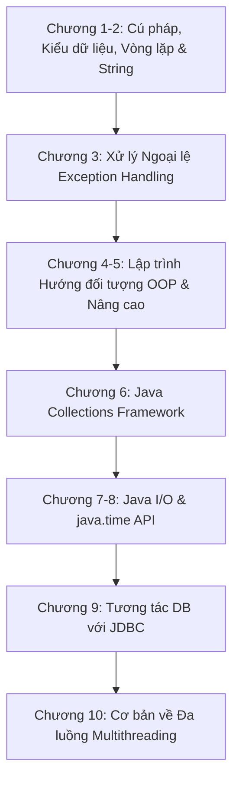
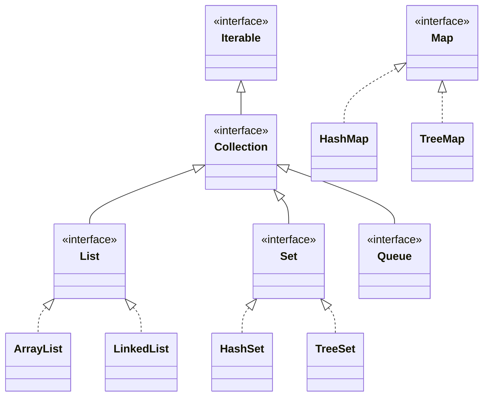

Java là một trong những ngôn ngữ lập trình hướng đối tượng phổ biến và bền bỉ nhất thế giới công nghệ. Được định hướng theo triết lý *"Write Once, Run Anywhere"* (WORA), Java cung cấp nền tảng quản lý bộ nhớ mạnh mẽ (Garbage Collection), hệ thống kiểu dữ liệu chặt chẽ và kiến trúc hướng đối tượng mẫu mực.

Bài viết này tổng hợp toàn bộ 10 chương cốt lõi của **Java Core** trong lộ trình **Java Fresher**, đi kèm kiến trúc xây dựng ứng dụng Console CRUD và thực hành JDBC chuẩn mực.

---

## 1. Lộ Trình 10 Chương Java Core Chuyên Sâu



### Chi tiết 10 chủ đề trọng tâm:
1. **Tổng quan & Cú pháp cơ bản:** Cấu trúc lớp `public class`, phương thức `main`, biến nguyên thủy (primitive) vs kiểu đối tượng (wrapper/reference), mảng 1 chiều và 2 chiều.
2. **Cấu trúc điều khiển & String:** `if-else`, `switch-case`, các vòng lặp `for`, `while`, `do-while`. Phân biệt `String` (bất biến), `StringBuilder` và `StringBuffer`.
3. **Xử lý Ngoại lệ (Exception Handling):** Phân biệt Checked Exception (`IOException`, `SQLException`) và Unchecked Exception (`NullPointerException`, `IllegalArgumentException`). Khối `try-catch-finally` và cú pháp `try-with-resources`.
4. **4 Trụ Cột Hướng Đối Tượng (OOP):**
   - **Đóng gói (Encapsulation):** Access modifiers (`private`, `protected`, `public`, `default`), Getter/Setter.
   - **Kế thừa (Inheritance):** Từ khóa `extends`, tái sử dụng thuộc tính và phương thức cha qua `super`.
   - **Đa hình (Polymorphism):** Nạp chồng phương thức (Overloading - compile-time) và Ghi đè phương thức (Overriding - runtime với `@Override`).
   - **Trừu tượng (Abstraction):** Lớp trừu tượng (`abstract class`) và ẩn giấu chi tiết cài đặt.
5. **OOP Nâng cao:** Giao diện (`interface`), `default method`, `static method`, `Generics` (`<T>`, `<?>`), Lớp lồng nhau (Inner/Static Nested classes).
6. **Java Collections Framework:** Phân cấp `Collection` (List, Set, Queue) và `Map`. Khi nào dùng `ArrayList` vs `LinkedList`, `HashSet` vs `TreeSet`, `HashMap` vs `ConcurrentHashMap`.
7. **Java I/O:** Luồng byte (`InputStream`, `OutputStream`), luồng ký tự (`Reader`, `Writer`), `BufferedReader`, `BufferedWriter`, và `java.nio.file.Files`.
8. **Date & Time API (Java 8+):** Thay thế `java.util.Date` bằng `LocalDate`, `LocalTime`, `LocalDateTime`, `ZonedDateTime` và định dạng qua `DateTimeFormatter`.
9. **JDBC (Java Database Connectivity):** Chu trình kết nối `DriverManager`, `Connection`, `PreparedStatement` chống SQL Injection, `ResultSet`, quản lý giao dịch thủ công (`setAutoCommit(false)`).
10. **Đa luồng & Bất đồng bộ (Multithreading):** Tạo luồng bằng kế thừa `Thread` hoặc cài đặt `Runnable`/`Callable`, từ khóa `synchronized`, trạng thái Deadlock và Thread Pool với `ExecutorService`.

---

## 2. Java Collections Framework Overview



- **List (Có thứ tự, cho phép phần tử trùng lặp):** `ArrayList` tối ưu cho việc truy cập ngẫu nhiên theo index $O(1)$; `LinkedList` tối ưu cho thêm/xóa đầu-đuôi $O(1)$.
- **Set (Không cho phép trùng lặp):** `HashSet` dùng hash table $O(1)$; `TreeSet` dựa trên Red-Black Tree duy trì thứ tự sắp xếp $O(\log n)$.
- **Map (Cặp Khóa - Giá trị):** `HashMap` cho tra cứu nhanh; `LinkedHashMap` duy trì thứ tự chèn; `TreeMap` sắp xếp theo thứ tự tự nhiên của khóa.

---

## 3. Thực Hành: Kiến Trúc Validator Với Functional Interface

Một trong những bài toán kinh điển khi viết ứng dụng Console là việc nhập dữ liệu từ người dùng (Scanner) và xác thực (Email, Số điện thoại, Điểm GPA). Thay vì lặp lại các vòng lặp `while(true)` ở mọi nơi, ta có thể xây dựng một hàm dùng `Predicate<String>`:

```java
import java.util.Scanner;
import java.util.function.Predicate;
import java.util.regex.Pattern;

public class InputValidatorUtils {

    private static final Pattern EMAIL_PATTERN = 
        Pattern.compile("^[A-Za-z0-9+_.-]+@[A-Za-z0-9.-]+$");
    private static final Pattern PHONE_PATTERN = 
        Pattern.compile("^\\d{10}$");

    /**
     * Hàm dùng chung để nhập dữ liệu có validate liên tục cho đến khi đúng
     */
    public static String inputWithValidation(
            Scanner scanner, 
            String promptMessage, 
            String errorMessage, 
            Predicate<String> validator) {
        while (true) {
            System.out.print(promptMessage);
            String input = scanner.nextLine().trim();
            if (validator.test(input)) {
                return input;
            }
            System.err.println("❌ " + errorMessage);
        }
    }

    public static void main(String[] args) {
        Scanner sc = new Scanner(System.in);

        // 1. Nhập và validate Email
        String email = inputWithValidation(
            sc,
            "Nhập Email: ",
            "Email không đúng định dạng (Ví dụ: student@fpt.edu.vn)!",
            s -> EMAIL_PATTERN.matcher(s).matches()
        );

        // 2. Nhập và validate Số điện thoại (10 chữ số)
        String phone = inputWithValidation(
            sc,
            "Nhập Số điện thoại: ",
            "Số điện thoại phải gồm đúng 10 chữ số!",
            s -> PHONE_PATTERN.matcher(s).matches()
        );

        // 3. Nhập và validate GPA (từ 0.0 đến 4.0)
        double gpa = Double.parseDouble(inputWithValidation(
            sc,
            "Nhập Điểm GPA (0.0 - 4.0): ",
            "GPA phải là số thực từ 0.0 đến 4.0!",
            s -> {
                try {
                    double val = Double.parseDouble(s);
                    return val >= 0.0 && val <= 4.0;
                } catch (NumberFormatException e) {
                    return false;
                }
            }
        ));

        System.out.println("\n✅ Thông tin đã nhập thành công:");
        System.out.printf("Email: %s | Phone: %s | GPA: %.2f\n", email, phone, gpa);
    }
}
```

---

## 4. Chuẩn Hóa Tương Tác Cơ Sở Dữ Liệu Với JDBC

Sử dụng `PreparedStatement` kết hợp `try-with-resources` để tự động đóng kết nối (Connection, Statement, ResultSet) và tránh thất thoát tài nguyên (Resource Leak):

```java
import java.sql.Connection;
import java.sql.DriverManager;
import java.sql.PreparedStatement;
import java.sql.ResultSet;
import java.sql.SQLException;
import java.util.ArrayList;
import java.util.List;

public class StudentDao {
    private static final String URL = "jdbc:postgresql://localhost:5432/study_lms";
    private static final String USER = "postgres";
    private static final String PASSWORD = "password";

    public List<String> getAllStudentNamesByMinGpa(double minGpa) {
        List<String> names = new ArrayList<>();
        String sql = "SELECT full_name FROM students WHERE gpa >= ? ORDER BY gpa DESC";

        try (Connection conn = DriverManager.getConnection(URL, USER, PASSWORD);
             PreparedStatement stmt = conn.prepareStatement(sql)) {

            stmt.setDouble(1, minGpa);

            try (ResultSet rs = stmt.executeQuery()) {
                while (rs.next()) {
                    names.add(rs.getString("full_name"));
                }
            }
        } catch (SQLException e) {
            System.err.println("Lỗi truy vấn cơ sở dữ liệu: " + e.getMessage());
        }
        return names;
    }
}
```

---

## 5. Tài Liệu Tham Khảo & Luyện Đề

> [!TIP]
> - 🧠 **NotebookLM Ôn tập Java:** [Mở NotebookLM Java](https://notebooklm.google.com/notebook/1384a327-c778-4fca-8fe3-cefc8b8f857c)
> - 💻 **Môi trường khuyến nghị:** Sử dụng **IntelliJ IDEA** kết hợp **OpenJDK 17 hoặc 21 (LTS)**.
