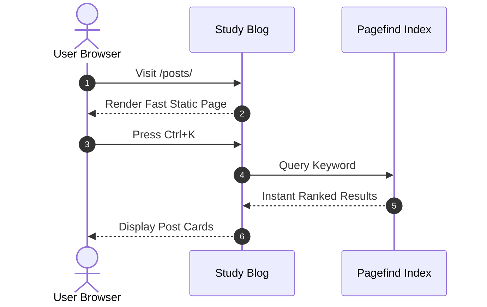

Study Blog natively supports **KaTeX** for mathematical formulas and **Mermaid** for technical diagrams.

## Mathematical Notation with KaTeX

You can write both inline and display math equations using standard LaTeX syntax.

### Inline Math

The Pythagorean theorem is represented as $a^2 + b^2 = c^2$.  
Euler's identity connects five fundamental mathematical constants: $e^{i\pi} + 1 = 0$.

### Display Math (Block)

The quadratic formula:

$$
x = \frac{-b \pm \sqrt{b^2 - 4ac}}{2a}
$$

The Gaussian normal distribution probability density function:

$$
f(x) = \frac{1}{\sigma \sqrt{2\pi}} \exp\left( -\frac{1}{2}\left(\frac{x - \mu}{\sigma}\right)^2 \right)
$$

Summation and limits:

$$
\sum_{k=1}^{n} k = \frac{n(n + 1)}{2}, \quad \lim_{x \to 0} \frac{\sin x}{x} = 1
$$

---

## Diagrams with Mermaid

Flowcharts, sequence diagrams, and architecture maps can be rendered directly from code blocks:

### Architecture Sequence

