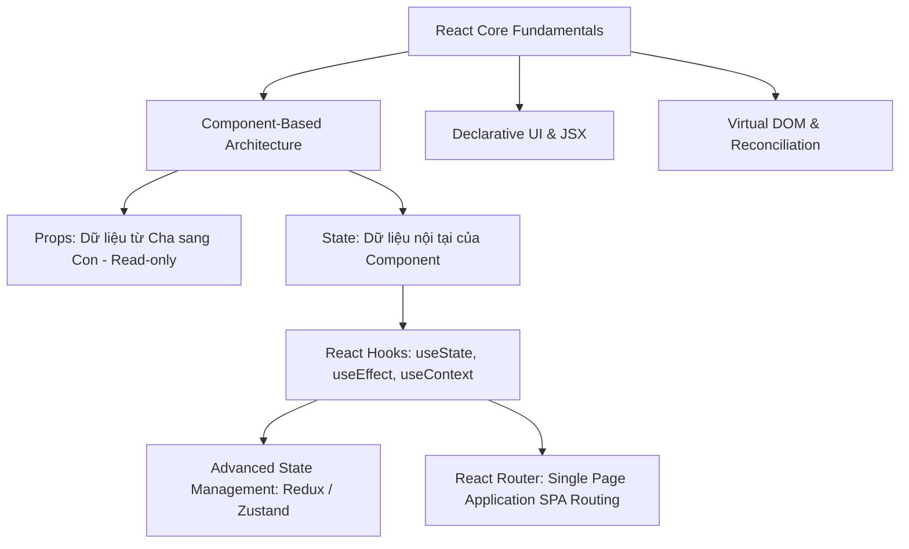
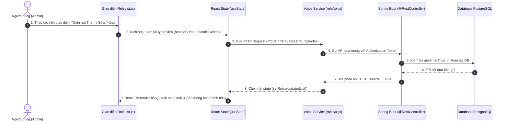

**React.js** là thư viện JavaScript phổ biến nhất thế giới để xây dựng giao diện người dùng (UI). Trong hệ sinh thái **Java Fullstack**, React đóng vai trò là tầng Frontend tương tác trực tiếp với người dùng và kết nối với Backend Spring Boot qua các chuẩn API RESTful hoặc GraphQL.

Bài viết này tổng hợp các kiến thức cốt lõi về React, các Hook quan trọng và phân tích chuyên sâu về quy trình thiết kế chức năng **Quản lý Phân quyền (Role Management CRUD)** từ chương trình **Java Fresher**.

---

## 1. Bản Đồ Nền Tảng React.js



### 15 Khái niệm cốt lõi cần ghi nhớ:
1. **React là gì:** Thư viện giao diện theo tư duy chia nhỏ thành các component độc lập, tái sử dụng được.
2. **Khởi tạo dự án:** Khuyến nghị dùng **Vite** (`npm create vite@latest my-app --template react`) thay cho Create React App cũ để tối ưu tốc độ build.
3. **JSX (JavaScript XML):** Cho phép lồng cú pháp thẻ giống HTML vào JavaScript. Bọc nhiều thẻ bằng `<>` (Fragment) và thuộc tính dùng camelCase (`className`, `onClick`).
4. **Component:** Ưu tiên Functional Components kết hợp cú pháp hàm mũi tên (Arrow Function).
5. **Props:** Đối tượng truyền tham số từ cha xuống con, mang tính chất chỉ đọc (**read-only**).
6. **State:** Dữ liệu có thể thay đổi và kích hoạt re-render giao diện thông qua `useState()`.
7. **Event Handling:** Truyền hàm xử lý sự kiện qua camelCase (`onClick={handleClick}`).
8. **Hook `useEffect`:** Xử lý side effects (gọi API, lắng nghe sự kiện, đồng bộ timer).
9. **Conditional Rendering:** Render có điều kiện bằng toán tử 3 ngôi (`condition ? <A /> : <B />`) hoặc short-circuit (`isLoaded && <Component />`).
10. **List Rendering:** Duyệt danh sách bằng `.map()`, bắt buộc khai báo thuộc tính `key` duy nhất và ổn định.
11. **Forms:** Biểu mẫu kiểm soát (Controlled Component) thông qua `value` và `onChange`.
12. **Lifecycle với Hook:**
    - `componentDidMount` $\rightarrow$ `useEffect(..., [])`
    - `componentDidUpdate` $\rightarrow$ `useEffect(..., [deps])`
    - `componentWillUnmount` $\rightarrow$ hàm return cleanup trong `useEffect`.
13. **React Router:** Điều hướng trang trong Single Page Application (SPA) mà không tải lại toàn trang.
14. **Quản lý State Nâng cao:** Sử dụng React Context API cho dữ liệu chung (Theme, Auth) hoặc Redux Toolkit cho các ứng dụng có luồng dữ liệu phức tạp.
15. **Tối ưu hiệu năng:** Tránh re-render thừa bằng `React.memo`, `useMemo`, `useCallback`.

---

## 2. Phân Tích Chuyên Sâu: Quy Trình Thiết Kế CRUD Quản Lý Role

Trong một hệ thống phân quyền doanh nghiệp (kết hợp với Spring Security ở Backend), module **Role Management** là bài toán kinh điển đòi hỏi sự phối hợp chặt chẽ giữa UI, State và API.

### 2.1 Sơ Đồ Luồng Hoạt Động (Flowchart)



---

## 3. Kiến Trúc Mã Nguồn CRUD Thực Tế

### 3.1 Dịch vụ Gọi API (`roleService.js`)

```javascript
import axios from "axios";

const API_BASE_URL = "http://localhost:8080/api/v1/roles";

export const roleService = {
    getAllRoles: async () => {
        const response = await axios.get(API_BASE_URL);
        return response.data;
    },

    createRole: async (roleData) => {
        const response = await axios.post(API_BASE_URL, roleData);
        return response.data;
    },

    updateRole: async (id, roleData) => {
        const response = await axios.put(`${API_BASE_URL}/${id}`, roleData);
        return response.data;
    },

    deleteRole: async (id) => {
        await axios.delete(`${API_BASE_URL}/${id}`);
    }
};
```

### 3.2 Component Quản Lý Danh Sách & Tương Tác State (`RoleManagement.jsx`)

```jsx
import React, { useState, useEffect } from "react";
import { roleService } from "./roleService";

export default function RoleManagement() {
    const [roles, setRoles] = useState([]);
    const [isLoading, setIsLoading] = useState(true);
    const [roleName, setRoleName] = useState("");
    const [roleDescription, setRoleDescription] = useState("");

    // 1. Tải danh sách Role khi component mount
    useEffect(() => {
        fetchRoles();
    }, []);

    const fetchRoles = async () => {
        try {
            setIsLoading(true);
            const data = await roleService.getAllRoles();
            setRoles(data);
        } catch (error) {
            console.error("Lỗi khi tải danh sách quyền:", error);
        } finally {
            setIsLoading(false);
        }
    };

    // 2. Xử lý tạo mới Role
    const handleCreateRole = async (e) => {
        e.preventDefault();
        if (!roleName.trim()) return;

        try {
            const newRole = await roleService.createRole({
                name: roleName.toUpperCase(),
                description: roleDescription
            });
            // Cập nhật state mà không cần gọi lại toàn bộ API
            setRoles((prev) => [...prev, newRole]);
            setRoleName("");
            setRoleDescription("");
        } catch (error) {
            alert("Lỗi khi tạo Role mới: " + error.message);
        }
    };

    // 3. Xử lý xóa Role
    const handleDeleteRole = async (id) => {
        if (!window.confirm("Bạn có chắc chắn muốn xóa quyền này?")) return;

        try {
            await roleService.deleteRole(id);
            setRoles((prev) => prev.filter((r) => r.id !== id));
        } catch (error) {
            alert("Không thể xóa quyền: " + error.message);
        }
    };

    return (
        <div className="role-management-container">
            <h2>Quản Lý Phân Quyền (Roles)</h2>

            {/* Form tạo mới */}
            <form onSubmit={handleCreateRole} className="role-form">
                <input
                    type="text"
                    placeholder="Tên Role (VD: ROLE_ADMIN)"
                    value={roleName}
                    onChange={(e) => setRoleName(e.target.value)}
                    required
                />
                <input
                    type="text"
                    placeholder="Mô tả chức năng"
                    value={roleDescription}
                    onChange={(e) => setRoleDescription(e.target.value)}
                />
                <button type="submit">➕ Thêm Role</button>
            </form>

            {/* Bảng danh sách */}
            {isLoading ? (
                <p>Đang tải dữ liệu...</p>
            ) : (
                <table className="role-table">
                    <thead>
                        <tr>
                            <th>ID</th>
                            <th>Tên Role</th>
                            <th>Mô Tả</th>
                            <th>Thao Tác</th>
                        </tr>
                    </thead>
                    <tbody>
                        {roles.map((role) => (
                            <tr key={role.id}>
                                <td>{role.id}</td>
                                <td><strong>{role.name}</strong></td>
                                <td>{role.description}</td>
                                <td>
                                    <button onClick={() => handleDeleteRole(role.id)}>
                                        🗑️ Xóa
                                    </button>
                                </td>
                            </tr>
                        ))}
                    </tbody>
                </table>
            )}
        </div>
    );
}
```

---

## 4. Tài Liệu Tham Khảo & Link Ôn Tập

> [!TIP]
> - 🧠 **NotebookLM Ôn tập React:** [Mở NotebookLM React](https://notebooklm.google.com/notebook/6b7d28b8-ca98-4859-82b5-982fbb3737bc)
> - 🚀 **Bài viết nâng cao:** Đọc thêm bài [Deep Dive into React 19: Actions, Server Components & Modern Architecture](/study-blog/posts/react/react-19-deep-dive/) nằm trong cùng series.
