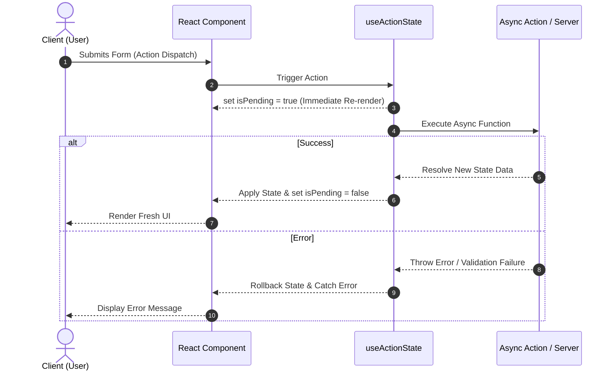
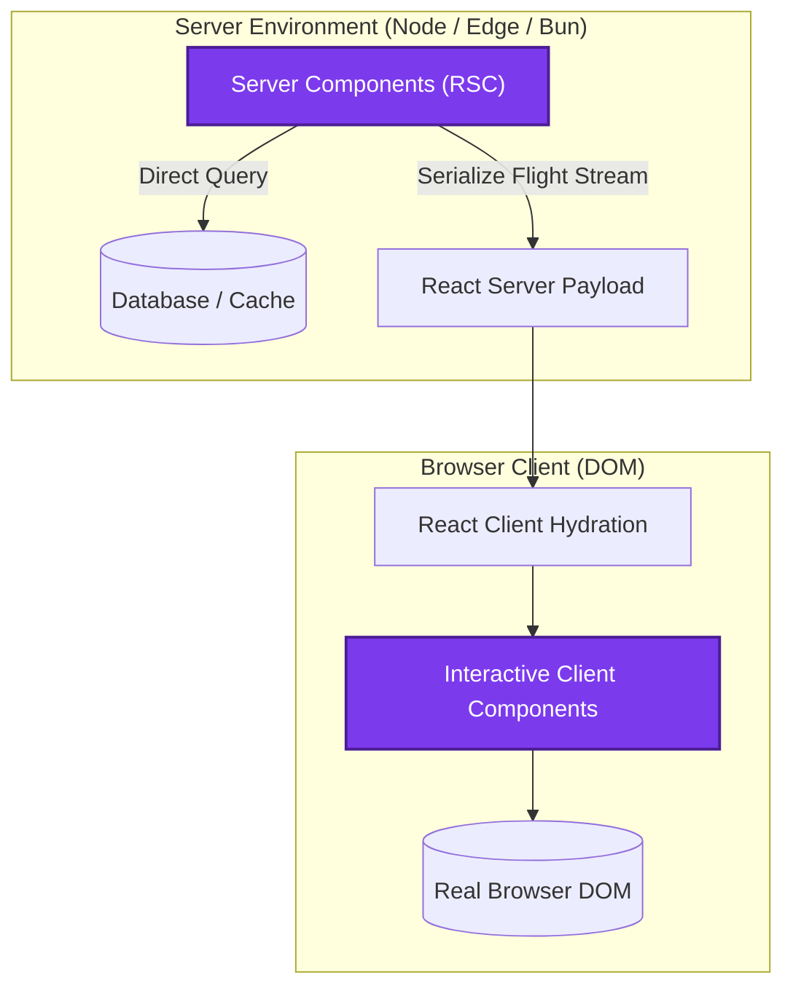

React 19 represents one of the most substantial architectural milestones in the React ecosystem. Rather than just introducing incremental APIs, it fundamentally shifts how state transitions, asynchronous operations, and server-client boundaries are handled.

In this deep dive, we explore the core mental models behind React 19, examine its flagship features with practical TypeScript code examples, and visualize the rendering pipeline.

---

## 1. The Core Shift: Transitions & Actions

In earlier versions of React, handling asynchronous operations required coordinating multiple `useState` hooks, `useEffect` lifecycles, and error states manually. React 19 introduces **Actions** &mdash; async functions executed within transitions that automatically manage pending states, optimistic updates, and error boundaries.

> [!NOTE]
> Actions automatically handle `isPending`, optimistic UI rollbacks, and sequential state execution without boilerplate state variables.

### 1.1 useActionState in Practice

The new `useActionState` hook replaces the repetitive pattern of `[isLoading, setIsLoading]` and `[error, setError]`:

```tsx
import { useActionState } from "react";

interface ProfileState {
  name: string;
  error?: string;
}

async function updateProfile(
  prevState: ProfileState,
  formData: FormData
): Promise<ProfileState> {
  const newName = formData.get("name") as string;
  if (!newName || newName.length < 3) {
    return { name: prevState.name, error: "Name must be at least 3 characters." };
  }

  // Simulate network request
  await new Promise((resolve) => setTimeout(resolve, 800));
  return { name: newName };
}

export function ProfileForm({ initialName }: { initialName: string }) {
  const [state, formAction, isPending] = useActionState(updateProfile, {
    name: initialName,
  });

  return (
    <form action={formAction} className="flex flex-col gap-4 max-w-md">
      <label className="font-semibold text-sm">
        Display Name:
        <input
          name="name"
          defaultValue={state.name}
          disabled={isPending}
          className="w-full px-3 py-2 border rounded mt-1"
        />
      </label>

      {state.error && (
        <p className="text-red-500 text-sm font-medium">{state.error}</p>
      )}

      <button
        type="submit"
        disabled={isPending}
        className="px-4 py-2 bg-indigo-600 text-white rounded font-medium disabled:opacity-50"
      >
        {isPending ? "Updating Profile..." : "Save Changes"}
      </button>
    </form>
  );
}
```

---

## 2. Action Execution Lifecycle

How does React 19 coordinate an asynchronous Action between the user interface and the server? The following sequence illustrates the complete lifecycle from dispatch to state resolution:



---

## 3. Mathematical Foundations of Reconciliation

At its algorithmic core, React's Virtual DOM reconciliation relies on heuristic tree diffing to maintain peak performance:

### 3.1 Computational Complexity

A general tree-to-tree transformation algorithm has a time complexity of $O(n^3)$, where $n$ is the number of nodes in the tree:

$$
T_{\text{classical}}(n) = \mathcal{O}(n^3)
$$

For a document with 1,000 DOM nodes, $1000^3 = 1,000,000,000$ operations would cause massive frame drops. React reduces this to linear time using two core heuristics:

$$
T_{\text{reconcile}}(n) = \mathcal{O}(n)
$$

1. Elements of different types produce completely different subtrees.
2. The developer can hint at which child elements remain stable across different renders with a stable `key` prop.

The state transition function under React's concurrent model can be formalized as:

$$
\text{State}_{t+1} = \mathcal{F}\left(\text{State}_t, \mathcal{A}_{\text{transition}}\right)
$$

---

## 4. Comparing React 18 and React 19

Here is a side-by-side comparison of how common developer tasks evolved:

| Capability | React 18 | React 19 |
| :--- | :--- | :--- |
| **Async State** | Manual `useState` + `useEffect` | Native `useActionState` & Actions |
| **Optimistic UI** | Third-party libraries / complex state | Native `useOptimistic` hook |
| **Form Management** | Controlled inputs & manual submit | Native `<form action={...}>` & `useFormStatus` |
| **Context API** | `<Context.Provider value={...}>` | `<Context value={...}>` (Clean Provider syntax) |
| **Ref Passing** | Mandatory `forwardRef(...)` wrapper | Native `ref` as standard prop |
| **Asset Preloading** | Custom `<link>` injections | Native `preload`, `preinit`, `preconnect` |
| **Memoization** | Manual `useMemo` & `useCallback` | Automatic with React Compiler |

> [!TIP]
> In React 19, you no longer need `forwardRef`! You can pass `ref` directly as a regular prop into functional components:
> ```tsx
> function CustomInput({ ref, label }: { ref: React.Ref<HTMLInputElement>; label: string }) {
>   return <input ref={ref} aria-label={label} />;
> }
> ```

---

## 5. React 19 Architecture Overview

The following diagram demonstrates how modern React applications separate Server Components (RSC) from Client Components while preserving continuous concurrent rendering:



---

## 6. Official Repository Reference

Check out the official React open-source repository on GitHub for release notes, source code, and discussions:

::github{repo="facebook/react"}

---

## 7. Migration Checklist

Ready to upgrade your projects to React 19? Follow this checklist:

- [x] Update dependencies: `react@^19.0.0` and `react-dom@^19.0.0`
- [x] Run React Codemod to replace deprecated `useMemo` / `useCallback` patterns
- [x] Remove obsolete `forwardRef` wrappers in favor of direct `ref` props
- [x] Convert `<Context.Provider>` to simplified `<Context>` tags
- [ ] Refactor form submissions to utilize native React 19 Actions

> [!WARNING]
> Ensure your third-party UI libraries (such as Radix, HeadlessUI, or MUI) officially list React 19 in their `peerDependencies` before upgrading production applications.

---

### Join the Discussion

What is your favorite new capability in React 19? Have you tested the React Compiler yet?  
Leave your thoughts and feedback in the comments below! 👇
