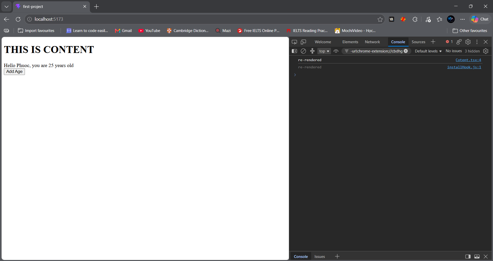
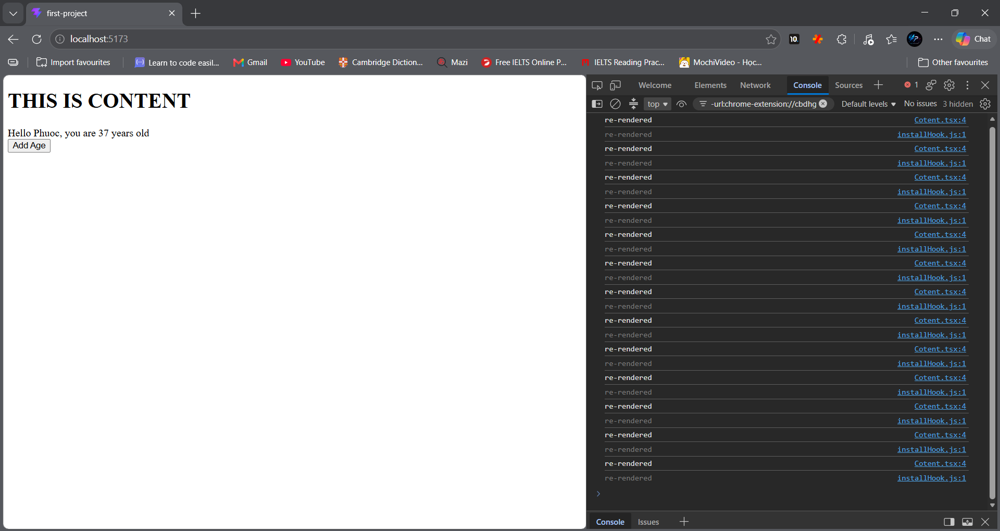
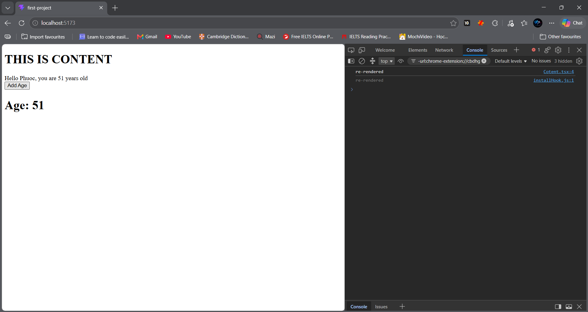
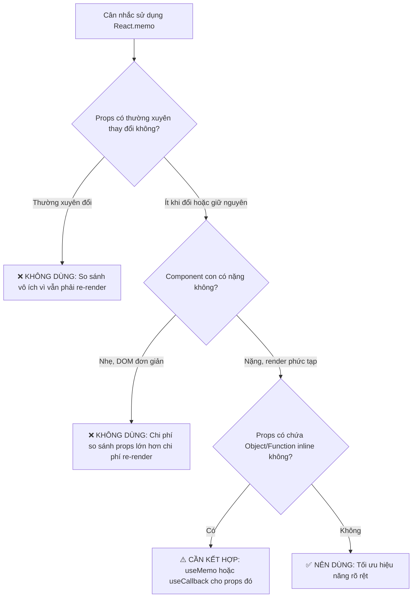

Khi mới bắt đầu tiếp cận React, hầu hết chúng ta đều quen thuộc với việc viết functional component đơn giản kết hợp cùng các hook cơ bản như `useState` hay `useEffect`. Mọi thứ hoạt động rất mượt mà trong các ứng dụng nhỏ. 

Tuy nhiên, khi dự án mở rộng, cấu trúc cây component trở nên phức tạp, dữ liệu (state/props) biến động liên tục và người dùng tương tác dồn dập, một bài toán lớn bắt đầu xuất hiện: **Hiệu năng (Performance)**.

Hiện tượng phổ biến nhất làm suy giảm hiệu năng trong React chính là **Re-render thừa thãi (Unnecessary Re-renders)**. Để giải quyết triệt để vấn đề này, React cung cấp cho chúng ta hai công cụ đắc lực: **`React.memo`** và **`useMemo()`**.

---

## 1. Cơ Chế Re-render Mặc Định & Vấn Đề Hiệu Năng

Trong React, cơ chế rendering hoạt động theo quy tắc thác nước (Top-Down):

> [!NOTE]
> **Quy tắc vàng:** Mỗi khi state của một component cha thay đổi, component cha đó sẽ re-render. Mặc định, **toàn bộ các component con bên trong nó cũng sẽ bị re-render theo**, bất kể props truyền vào component con có thay đổi hay không!

Hãy cùng xem xét ví dụ thực tế dưới đây:

### 1.1 Đoạn mã minh họa

Giả sử ta có component con `Content.tsx` không hề nhận props nào từ cha:

```tsx
// Content.tsx
function Content() {
  console.log("re-rendered");
  return <h1>THIS IS CONTENT</h1>;
}

export default Content;
```

Và component cha `App.tsx` nắm giữ state `age`:

```tsx
// App.tsx
import { useState } from "react";
import "./App.css";
import Content from "./Content";

interface HelloProps {
  name: string;
  age: number;
}

const Hello = ({ name, age }: HelloProps) => {
  return <div>Hello {name}, you are {age} years old</div>;
};

function App() {
  const [age, setAge] = useState(25);

  return (
    <>
      <Content />
      <Hello name="Phuoc" age={age} />
      <button onClick={() => setAge(age + 1)}>Add Age</button>
    </>
  );
}

export default App;
```

### 1.2 Hiện tượng xảy ra khi chạy ứng dụng

Khi trang vừa khởi chạy, component `Content` render lần đầu tiên và console hiển thị:



Tuy nhiên, mỗi lần người dùng nhấn nút **"Add Age"**, state `age` trong `App` thay đổi:
1. `App` re-render để cập nhật số tuổi mới cho `Hello`.
2. Dù `Content` hoàn toàn độc lập và không liên quan gì đến `age`, nó **vẫn bị re-render liên tục**!



Trong ví dụ nhỏ này, việc re-render một thẻ `<h1>` không làm trình duyệt bị đơ. Nhưng hãy tưởng tượng nếu `Content` là một biểu đồ lớn, một danh sách 1.000 dòng dữ liệu hoặc một form nhập liệu phức tạp, việc re-render liên tục sẽ gây tụt FPS và tạo cảm giác giật lag rõ rệt cho người dùng.

---

## 2. Giải Pháp 1: Tối Ưu Component Với `React.memo`

### 2.1 React.memo là gì?
`React.memo` là một **Higher-Order Component (HOC)**. Nó nhận vào một component và trả về một component mới có khả năng **ghi nhớ (memoize)** kết quả render.

Trước mỗi lượt re-render, React sẽ tiến hành **so sánh nông (Shallow Comparison)** các props mới với props cũ:
- Nếu toàn bộ props **không đổi**: React bỏ qua lượt render của component đó và tái sử dụng cây DOM đã render từ trước.
- Nếu có ít nhất một prop **thay đổi**: Component mới thực sự re-render.

### 2.2 Áp dụng `React.memo` vào mã nguồn

Ta chỉ cần bọc component `Content` bằng hàm `memo()` từ thư viện `react`:

```tsx
// Content.tsx
import { memo } from "react";

function Content() {
  console.log("re-rendered");
  return <h1>THIS IS CONTENT</h1>;
}

// Bọc component bằng memo trước khi export
export default memo(Content);
```

### 2.3 Kết quả sau khi tối ưu

Bây giờ, dù người dùng có nhấn nút tăng tuổi từ 25 lên đến 51 (kích hoạt 26 lần re-render ở component cha), dòng log `"re-rendered"` vẫn chỉ xuất hiện **đúng 1 lần duy nhất** lúc khởi tạo!



---

## 3. Khi Nào Nên & Không Nên Dùng `React.memo`?

Một câu hỏi rất quan trọng được đặt ra: **Có phải component nào ta cũng nên bọc `React.memo` không?**

> [!WARNING]
> **Không nên lạm dụng `React.memo`!** Việc bọc `memo` bừa bãi không giúp ứng dụng chạy nhanh hơn mà thậm chí có thể khiến ứng dụng chậm đi vì chi phí so sánh props (Shallow Comparison overhead).



### 3.1 Các trường hợp NÊN dùng:
1. Component con thuần giao diện hiển thị (Pure UI Component), nhận props đơn giản (`string`, `number`, `boolean`).
2. Component con có kích thước lớn, chứa nhiều phần tử DOM con hoặc xử lý layout nặng.
3. Component con nằm trong một component cha có state thay đổi liên tục (như timer, slider, input text) nhưng các thay đổi đó không ảnh hưởng đến component con.

### 3.2 Cạm bẫy với Object / Function Props (Reference Equality)
Trong JavaScript, `{} !== {}` và `() => {} !== () => {}`. Nếu component cha truyền prop là một object hoặc callback function được viết inline:

```tsx
// ⚠️ VẤN ĐỀ: Mỗi lần App render, hàm handleClick tạo ra ô nhớ mới!
<MemoizedButton onClick={() => console.log("clicked")} />
```

Vì `React.memo` chỉ so sánh địa chỉ tham chiếu (Shallow Equal), nó sẽ thấy `prevProps.onClick !== nextProps.onClick`, dẫn đến `memo` bị **vô hiệu hóa** hoàn toàn. Trong tình huống này, ta bắt buộc phải kết hợp cùng **`useCallback`**.

---

## 4. Giải Pháp 2: Tối Ưu Tính Toán Phức Tạp Với `useMemo()`

Nếu như `React.memo` dùng để bảo vệ một **Component**, thì **`useMemo()`** là một React Hook dùng để ghi nhớ **kết quả tính toán của một biểu thức logic nặng (Expensive Calculation)**.

### 4.1 Cú pháp cơ bản
```tsx
const memoizedValue = useMemo(() => {
  return computeExpensiveValue(a, b);
}, [a, b]); // Dependency array: Chỉ tính lại khi a hoặc b thay đổi
```

### 4.2 Bài toán thực tế: Lọc và tính tổng giỏ hàng

Giả sử bạn xây dựng trang giỏ hàng với danh sách sản phẩm lớn. Mỗi khi tính tổng tiền, hệ thống phải duyệt qua mảng và thực hiện logic nặng. 

Đồng thời, trên trang có các tính năng tương tác khác như nút chuyển đổi giao diện Sáng/Tối (`isDarkMode`) hoặc bộ đếm số (`counter`).

```tsx
// CartCheckout.tsx
import { useState, useMemo } from "react";

interface Product {
  id: number;
  name: string;
  price: number;
}

// Dữ liệu mẫu danh sách sản phẩm
const initialProducts: Product[] = [
  { id: 1, name: "Bàn phím cơ Custom", price: 2500000 },
  { id: 2, name: "Chuột không dây công thái học", price: 1850000 },
  { id: 3, name: "Màn hình 4K Dell UltraSharp", price: 12500000 },
  { id: 4, name: "Tai nghe chống ồn Sony", price: 4200000 },
  { id: 5, name: "Ghế công thái học Herman Miller", price: 28000000 },
];

// Hàm giả lập phép tính tốn nhiều chu kỳ CPU
function calculateTotalPrice(products: Product[]): number {
  console.log("⏳ [EXPENSIVE] Đang chạy phép tính tổng tiền toàn bộ sản phẩm...");
  
  // Giả lập phép lặp tiêu tốn tài nguyên
  let dummy = 0;
  for (let i = 0; i < 50000000; i++) {
    dummy += i % 2;
  }

  return products.reduce((sum, item) => sum + item.price, 0);
}

export default function CartCheckout() {
  const [products, setProducts] = useState<Product[]>(initialProducts);
  const [count, setCount] = useState<number>(0);
  const [isDarkMode, setIsDarkMode] = useState<boolean>(false);

  // ❌ NẾU KHÔNG DÙNG useMemo:
  // Mỗi khi bấm nút đổi màu giao diện hoặc tăng counter, calculateTotalPrice() 
  // đều bị chạy lại từ đầu dù mảng products không đổi!
  // const totalPrice = calculateTotalPrice(products);

  // ✅ KHI SỬ DỤNG useMemo:
  // Kết quả tổng tiền được lưu vào bộ nhớ cache. Hàm chỉ chạy lại duy nhất 
  // khi danh sách `products` có sự thêm/sửa/xóa phần tử.
  const totalPrice = useMemo(() => {
    return calculateTotalPrice(products);
  }, [products]);

  return (
    <div
      style={{
        padding: "24px",
        borderRadius: "12px",
        backgroundColor: isDarkMode ? "#0f172a" : "#f8fafc",
        color: isDarkMode ? "#f8fafc" : "#0f172a",
        transition: "all 0.3s ease",
      }}
    >
      <h2>🛒 Quản Lý Giỏ Hàng</h2>
      <p style={{ fontSize: "18px" }}>
        Tổng thanh toán:{" "}
        <strong style={{ color: "#2563eb" }}>
          {totalPrice.toLocaleString("vi-VN")} VNĐ
        </strong>
      </p>

      <hr style={{ margin: "20px 0", borderColor: "#334155" }} />

      <h3>Các thao tác không liên quan đến giỏ hàng:</h3>
      <div style={{ display: "flex", gap: "12px", alignItems: "center" }}>
        <button
          onClick={() => setCount((prev) => prev + 1)}
          style={{ padding: "8px 16px", cursor: "pointer" }}
        >
          Tăng Counter: {count}
        </button>

        <button
          onClick={() => setIsDarkMode((prev) => !prev)}
          style={{ padding: "8px 16px", cursor: "pointer" }}
        >
          Đổi theme: {isDarkMode ? "🌙 Dark" : "☀️ Light"}
        </button>
      </div>
    </div>
  );
}
```

### 4.3 Điểm mấu chốt:
- Khi người dùng nhấn **"Đổi theme"** hoặc **"Tăng Counter"**, state `isDarkMode` / `count` thay đổi làm `CartCheckout` re-render.
- Nhờ có `useMemo(..., [products])`, React nhận thấy tham chiếu `products` không đổi $\rightarrow$ trả về ngay giá trị `totalPrice` đã lưu trong cache mà **không hề chạy lại hàm tính toán nặng**.
- Giao diện chuyển đổi giao diện mượt mà tức thì, không bị khựng (freeze frame)!

---

## 5. So Sánh Nhanh: `React.memo` vs `useMemo`

| Tiêu chí | `React.memo` | `useMemo()` |
| :--- | :--- | :--- |
| **Bản chất** | Higher-Order Component (HOC) | React Hook |
| **Mục đích** | Ngăn Component con re-render khi props không đổi | Ghi nhớ kết quả của phép tính logic phức tạp |
| **Phạm vi áp dụng** | Bọc bên ngoài định nghĩa Component | Dùng trực tiếp bên trong thân Functional Component |
| **Cơ chế so sánh** | So sánh nông (Shallow Compare) các `props` | Theo dõi sự thay đổi của mảng phụ thuộc (`deps`) |
| **Ví dụ điển hình** | Bọc `<UserAvatar />`, `<ProductCard />`, `<DataTable />` | Lọc dữ liệu lớn, tính toán ma trận, lọc đồ thị, regex phức tạp |

---

## 6. Lời Khuyên Thực Chiến (Best Practices)

1. **Đừng tối ưu hóa sớm (Avoid Premature Optimization):** Hãy viết code một cách tự nhiên và mạch lạc trước. Chỉ can thiệp tối ưu khi nhận thấy dấu hiệu giảm hiệu năng hoặc khi làm việc với các thành phần dữ liệu lớn.
2. **Đo lường trước bằng công cụ:** Sử dụng tab **Profiler** trong **React Developer Tools** để ghi lại (record) và xem chính xác component nào đang tốn thời gian re-render nhiều nhất.
3. **Tương lai với React Compiler:** Bắt đầu từ React 19, với sự xuất hiện của **React Compiler**, mã nguồn React có thể được tự động phân tích và tối ưu hóa (auto-memoization) ngay ở bước biên dịch mà không đòi hỏi lập trình viên phải gắn `memo` hay `useMemo` thủ công. Tuy nhiên, việc nắm vững bản chất tư duy này là nền tảng cốt lõi của mọi lập trình viên React chuyên nghiệp.
