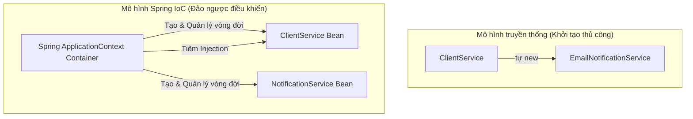
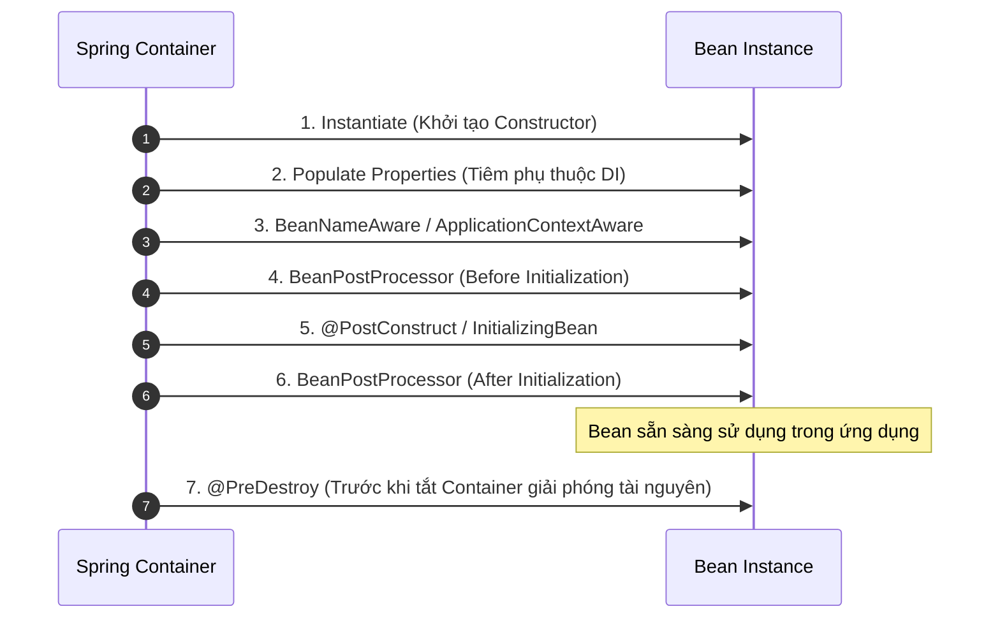
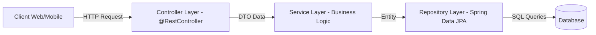
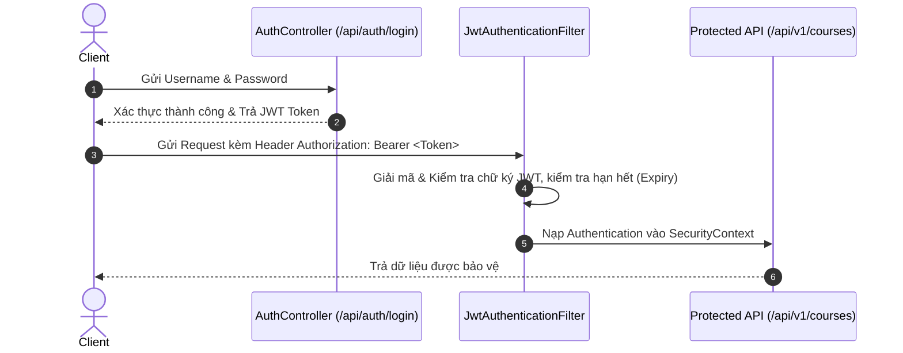

**Spring Framework** là nền tảng số một để phát triển các ứng dụng doanh nghiệp phía máy chủ (Enterprise Server-Side Applications) trong hệ sinh thái Java. Với sự ra đời của **Spring Boot**, việc cấu hình phức tạp đã được thay thế bằng triết lý *"Convention over Configuration"*, cho phép lập trình viên tạo ra các dịch vụ sẵn sàng chạy sản xuất (production-ready) chỉ trong vài phút.

Bài viết này tổng hợp toàn bộ các khái niệm nòng cốt, luồng hoạt động của RESTful API và kiến trúc bảo mật với Spring Security & JWT trong lộ trình **Java Fresher**.

---

## 1. Hai Nguyên Lý Cốt Lõi: IoC & Dependency Injection



### 1.1 Inversion of Control (IoC)
Thay vì bản thân lớp dịch vụ tự chịu trách nhiệm khởi tạo đối tượng phụ thuộc (`new Service()`), quyền kiểm soát việc tạo lập và vòng đời của đối tượng được trao lại cho **Spring IoC Container**.

### 1.2 Dependency Injection (DI)
Cách thức mà IoC Container chuyển giao đối tượng phụ thuộc vào bean cần sử dụng. Trong Spring hiện đại, **Constructor Injection** luôn là giải pháp được khuyến nghị cao nhất:

```java
@Service
public class OrderService {

    private final PaymentProcessor paymentProcessor;
    private final NotificationService notificationService;

    // Constructor Injection (Không cần @Autowired từ Spring 4.3+)
    public OrderService(PaymentProcessor paymentProcessor, 
                        NotificationService notificationService) {
        this.paymentProcessor = paymentProcessor;
        this.notificationService = notificationService;
    }

    public void processOrder(OrderRequest request) {
        paymentProcessor.charge(request.getAmount());
        notificationService.sendReceipt(request.getCustomerEmail());
    }
}
```

---

## 2. Vòng Đời Của Một Spring Bean (Bean Lifecycle)



---

## 3. Kiến Trúc 3 Tầng Chuẩn & Xây Dựng REST API

Mô hình phân tầng tiêu chuẩn cho ứng dụng Spring Boot:



### 3.1 Controller Xử Lý RESTful API với DTO

```java
@RestController
@RequestMapping("/api/v1/students")
public class StudentController {

    private final StudentService studentService;

    public StudentController(StudentService studentService) {
        this.studentService = studentService;
    }

    @PostMapping
    public ResponseEntity<StudentResponseDto> createStudent(
            @Valid @RequestBody CreateStudentRequestDto request) {
        StudentResponseDto created = studentService.createStudent(request);
        return ResponseEntity.status(HttpStatus.CREATED).body(created);
    }

    @GetMapping("/{id}")
    public ResponseEntity<StudentResponseDto> getStudentById(@PathVariable Long id) {
        return ResponseEntity.ok(studentService.getStudentById(id));
    }
}
```

### 3.2 Tầng Xử Lý Ngoại Lệ Tập Trung (@RestControllerAdvice)

```java
@RestControllerAdvice
public class GlobalExceptionHandler {

    @ExceptionHandler(ResourceNotFoundException.class)
    public ResponseEntity<ApiErrorResponse> handleNotFound(ResourceNotFoundException ex) {
        ApiErrorResponse error = new ApiErrorResponse(
            HttpStatus.NOT_FOUND.value(),
            ex.getMessage(),
            LocalDateTime.now()
        );
        return ResponseEntity.status(HttpStatus.NOT_FOUND).body(error);
    }

    @ExceptionHandler(MethodArgumentNotValidException.class)
    public ResponseEntity<Map<String, String>> handleValidation(MethodArgumentNotValidException ex) {
        Map<String, String> errors = new HashMap<>();
        ex.getBindingResult().getFieldErrors().forEach(err -> 
            errors.put(err.getField(), err.getDefaultMessage()));
        return ResponseEntity.badRequest().body(errors);
    }
}
```

---

## 4. Tích Hợp Cơ Sở Dữ Liệu Với Spring Data JPA

Spring Data JPA tự động sinh câu truy vấn SQL thông qua cú pháp đặt tên phương thức (Derived Query Methods):

```java
@Repository
public interface StudentRepository extends JpaRepository<Student, Long> {

    // Tự động sinh SQL: SELECT * FROM students WHERE email = ?
    Optional<Student> findByEmail(String email);

    // Lọc theo GPA và sắp xếp
    List<Student> findByGpaGreaterThanEqualOrderByGpaDesc(Double minGpa);

    // Truy vấn tùy biến với JPQL
    @Query("SELECT s FROM Student s WHERE s.department.code = :deptCode")
    List<Student> findByDepartmentCode(@Param("deptCode") String deptCode);
}
```

---

## 5. Bảo Mật Hệ Thống Với Spring Security & JWT



---

## 6. Các Dự Án Thực Hành Lớn

1. **Ex 1 - LMS (Learning Management System):** Module môn học, lớp học và quản lý học viên.
2. **Ex 2 - Dynamic Menu Management System:** Hệ thống phân cấp danh mục menu đệ quy.
3. **Ex 3 - User & Security Management System:** Quản lý người dùng, phân quyền Role/Permission.
4. **Ex 4 - Training Material Management:** Quản lý tải lên, lưu trữ tài liệu khóa học.
5. **Ex 5 - Training Management REST API with JWT Authentication:** Dự án tích hợp đầy đủ từ Security, JPA đến DTO validation.

---

## 7. Tài Nguyên & Link Ôn Tập

> [!TIP]
> - 🧠 **NotebookLM Ôn tập Spring:** [Mở NotebookLM Spring](https://notebooklm.google.com/notebook/a9fe3af1-7d07-45ee-a271-e790602c3939)
> - 📂 **Quy tắc tổ chức bài tập Git:** Tạo thư mục `Spring/` và lưu các bài lab theo tên `Ex1, Ex2...` (Notion) hoặc `ASM1, ASM2...` (FSA).
