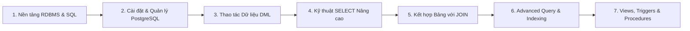
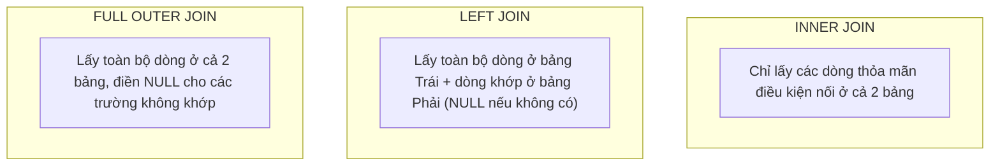

Trong kiến trúc ứng dụng doanh nghiệp, Cơ sở dữ liệu quan hệ (Relational Database Management System - RDBMS) là nơi lưu trữ, bảo toàn và truy xuất dữ liệu một cách an toàn và nhất quán. Đối với lập trình viên Java Backend, thành thạo **SQL** và **PostgreSQL** là điều kiện tiên quyết trước khi tiếp cận các công nghệ ORM như Hibernate hay Spring Data JPA.

Bài viết này tổng hợp 7 chương kiến thức nền tảng cùng bộ **PostgreSQL Cheat Sheet** thực chiến từ chương trình **Java Fresher**.

---

## 1. Bản Đồ Lộ Trình 7 Chương Học Tập



### Chi tiết các chương:
1. **Nền tảng RDBMS & SQL:** Mô hình quan hệ, Khóa chính (Primary Key), Khóa ngoại (Foreign Key), Chuẩn hóa dữ liệu (1NF, 2NF, 3NF).
2. **PostgreSQL & Quản lý cơ sở dữ liệu:** Cài đặt PostgreSQL, quản lý schema, bảng, phân quyền người dùng qua công cụ dòng lệnh `psql` và PgAdmin.
3. **Thao tác Dữ liệu (DML):** Các câu lệnh `INSERT`, `UPDATE`, `DELETE`, và xử lý xung đột `ON CONFLICT DO UPDATE` (Upsert).
4. **Truy vấn Dữ liệu (DQL):** Kỹ thuật `SELECT`, lọc điều kiện `WHERE`, gom nhóm `GROUP BY`, điều kiện nhóm `HAVING`, sắp xếp `ORDER BY`, phân trang `LIMIT / OFFSET`.
5. **Kết hợp dữ liệu bằng JOIN:** Phân biệt `INNER JOIN`, `LEFT JOIN`, `RIGHT JOIN`, `FULL OUTER JOIN`, `CROSS JOIN` và tự kết hợp (`SELF JOIN`).
6. **Truy vấn nâng cao & Best Practices:** Truy vấn con (`SUBQUERY`), Biểu thức bảng chung (`WITH` CTE), Window Functions (`ROW_NUMBER()`, `RANK()`), Chỉ mục (`B-Tree Index`), tối ưu hóa câu truy vấn qua `EXPLAIN ANALYZE`.
7. **Đối tượng nâng cao trong DB:** Khung nhìn (`VIEW` & `MATERIALIZED VIEW`), hàm (`FUNCTION`), thủ tục lưu trữ (`STORED PROCEDURE`), bộ kích hoạt (`TRIGGER`).

---

## 2. PostgreSQL Cheat Sheet Thực Chiến

### 2.1 Quản trị cơ bản trong `psql`

```bash
# Kết nối vào PostgreSQL qua terminal
psql -U postgres -d postgres

# Các lệnh meta trong psql:
\l              # Liệt kê tất cả cơ sở dữ liệu
\c database_name# Chuyển sang cơ sở dữ liệu khác
\dt             # Liệt kê tất cả các bảng trong schema hiện tại
\d table_name   # Xem chi tiết cấu trúc cột, kiểu dữ liệu, index của bảng
\q              # Thoát psql
```

### 2.2 Tạo Bảng & Ràng Buộc Dữ Liệu (DDL)

```sql
-- Tạo bảng học viên với các ràng buộc chuẩn
CREATE TABLE students (
    id SERIAL PRIMARY KEY,
    student_code VARCHAR(20) UNIQUE NOT NULL,
    full_name VARCHAR(100) NOT NULL,
    email VARCHAR(100) UNIQUE NOT NULL,
    gpa NUMERIC(3, 2) CHECK (gpa >= 0.0 AND gpa <= 4.0),
    is_active BOOLEAN DEFAULT TRUE,
    created_at TIMESTAMP WITH TIME ZONE DEFAULT CURRENT_TIMESTAMP
);

-- Tạo bảng lớp học
CREATE TABLE classes (
    id SERIAL PRIMARY KEY,
    class_name VARCHAR(50) NOT NULL,
    room_number VARCHAR(20)
);

-- Tạo bảng quan hệ nhiều-nhiều (Enrollments)
CREATE TABLE enrollments (
    student_id INT REFERENCES students(id) ON DELETE CASCADE,
    class_id INT REFERENCES classes(id) ON DELETE CASCADE,
    enrolled_date DATE DEFAULT CURRENT_DATE,
    PRIMARY KEY (student_id, class_id)
);
```

### 2.3 Thao tác Dữ liệu (DML) & Upsert

```sql
-- Thêm bản ghi mới
INSERT INTO students (student_code, full_name, email, gpa)
VALUES ('SV001', 'Nguyễn Văn An', 'an.nguyen@example.com', 3.65);

-- Thêm nhiều bản ghi cùng lúc
INSERT INTO students (student_code, full_name, email, gpa)
VALUES 
    ('SV002', 'Trần Thị Bình', 'binh.tran@example.com', 3.80),
    ('SV003', 'Lê Hoàng Cường', 'cuong.le@example.com', 2.95);

-- Kỹ thuật Upsert (Insert nếu chưa có, Update nếu trùng email)
INSERT INTO students (student_code, full_name, email, gpa)
VALUES ('SV001', 'Nguyễn Văn An Cập Nhật', 'an.nguyen@example.com', 3.75)
ON CONFLICT (email) 
DO UPDATE SET 
    full_name = EXCLUDED.full_name,
    gpa = EXCLUDED.gpa;
```

---

## 3. Các Phép JOIN & Phân Biệt Thực Tế



### Ví dụ Truy vấn JOIN và Báo cáo Thống kê:

```sql
-- Lấy danh sách lớp kèm số lượng học viên đã đăng ký (kể cả lớp chưa có sinh viên nào)
SELECT 
    c.id AS class_id,
    c.class_name,
    COUNT(e.student_id) AS total_students,
    COALESCE(ROUND(AVG(s.gpa), 2), 0) AS average_gpa
FROM classes c
LEFT JOIN enrollments e ON c.id = e.class_id
LEFT JOIN students s ON e.student_id = s.id
GROUP BY c.id, c.class_name
HAVING COUNT(e.student_id) >= 0
ORDER BY total_students DESC, c.class_name ASC;
```

---

## 4. Truy Vấn Nâng Cao (Window Functions & CTE)

### 4.1 Xếp Hạng Với Window Functions

Giả sử cần tìm sinh viên có điểm GPA cao nhất trong mỗi lớp học mà không dùng vòng lặp hay subquery phức tạp:

```sql
WITH RankedStudents AS (
    SELECT 
        c.class_name,
        s.student_code,
        s.full_name,
        s.gpa,
        DENSE_RANK() OVER (
            PARTITION BY c.id 
            ORDER BY s.gpa DESC
        ) AS gpa_rank
    FROM classes c
    JOIN enrollments e ON c.id = e.class_id
    JOIN students s ON e.student_id = s.id
)
SELECT class_name, student_code, full_name, gpa
FROM RankedStudents
WHERE gpa_rank = 1;
```

---

## 5. Quản Lý Giao Dịch (ACID Transactions)

Để đảm bảo dữ liệu không bị sai lệch trong môi trường đa luồng và hệ thống tài chính/ngân hàng:

- **A - Atomicity (Nguyên tử):** Toàn bộ các câu lệnh trong khối đều thành công, hoặc không câu lệnh nào có hiệu lực.
- **C - Consistency (Nhất quán):** Dữ liệu luôn tuân thủ các ràng buộc khóa và schema.
- **I - Isolation (Cô lập):** Các giao dịch diễn ra đồng thời không đọc dữ liệu bẩn của nhau.
- **D - Durability (Bền vững):** Một khi đã COMMIT, dữ liệu được ghi vào đĩa và không bị mất ngay cả khi sập nguồn.

```sql
BEGIN;

-- Trừ số dư ví sinh viên
UPDATE accounts 
SET balance = balance - 500000 
WHERE student_id = 1 AND balance >= 500000;

-- Ghi nhận hóa đơn học phí
INSERT INTO invoices (student_id, amount, status) 
VALUES (1, 500000, 'PAID');

-- Xác nhận giao dịch
COMMIT;

-- Hoặc hủy bỏ giao dịch nếu có lỗi phát sinh:
-- ROLLBACK;
```

---

## 6. Tài Nguyên & Link Ôn Tập Trực Tuyến

> [!TIP]
> - 🐘 **Tải PostgreSQL chính thức:** [PostgreSQL Downloads](https://www.postgresql.org/)
> - 🧠 **NotebookLM Ôn tập Database:** [Mở NotebookLM SQL](https://notebooklm.google.com/notebook/c7937227-96f7-4061-a34d-e8868a46e4a5)
> - 🎯 **Quy tắc tổ chức bài tập Git:** Tạo thư mục riêng cho môn Database/SQL và đặt tên bài tập theo quy tắc `Ex1, Ex2...` (Notion) hoặc `ASM1, ASM2...` (FSA).
